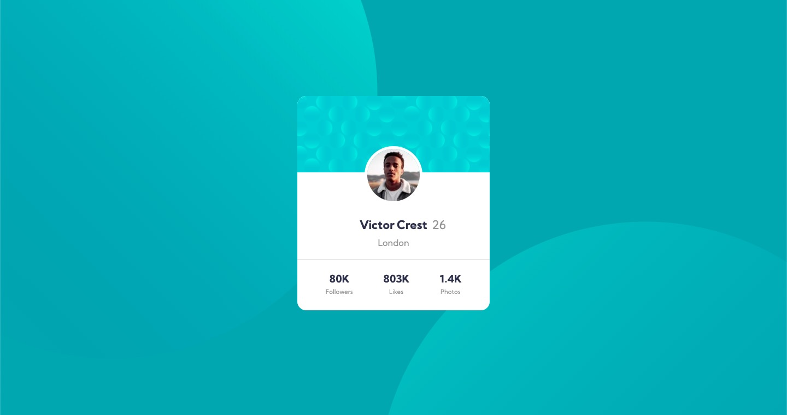

# Frontend Mentor - Profile card component solution

This is a solution to the [Profile card component challenge on Frontend Mentor](https://www.frontendmentor.io/challenges/profile-card-component-cfArpWshJ). 

## Table of contents

- [Overview](#overview)
  - [The challenge](#the-challenge)
  - [Screenshot](#screenshot)
  - [Links](#links)
- [My process](#my-process)
  - [Built with](#built-with)
  - [What I learned](#what-i-learned)
- [Author](#author)

## Overview

### The challenge

Users should be able to:

- View the optimal layout depending on their device's screen size
- See hover states for interactive elements

### Screenshot



### Links

- [Solution URL](https://github.com/GuiLucas/profile-card-component-main)
- [Live Site URL](https://guilucas.github.io/profile-card-component-main/)

## My process

### Built with

- Semantic HTML5 markup
- CSS custom properties
- CSS Grid

### What I learned

#### Using 2 images in background

```css
.body {
  background-image: 
        url(/images/bg-pattern-top.svg),
        url(/images/bg-pattern-bottom.svg);
    background-position: 
    top -40vh right 52vw, top 51vh left 48vw;
}
```

## Author

- Website - [Guilherme Lucas](https://www.guilhermelucas.com)
- Frontend Mentor - [@guilucas](https://www.frontendmentor.io/profile/guilucas)
